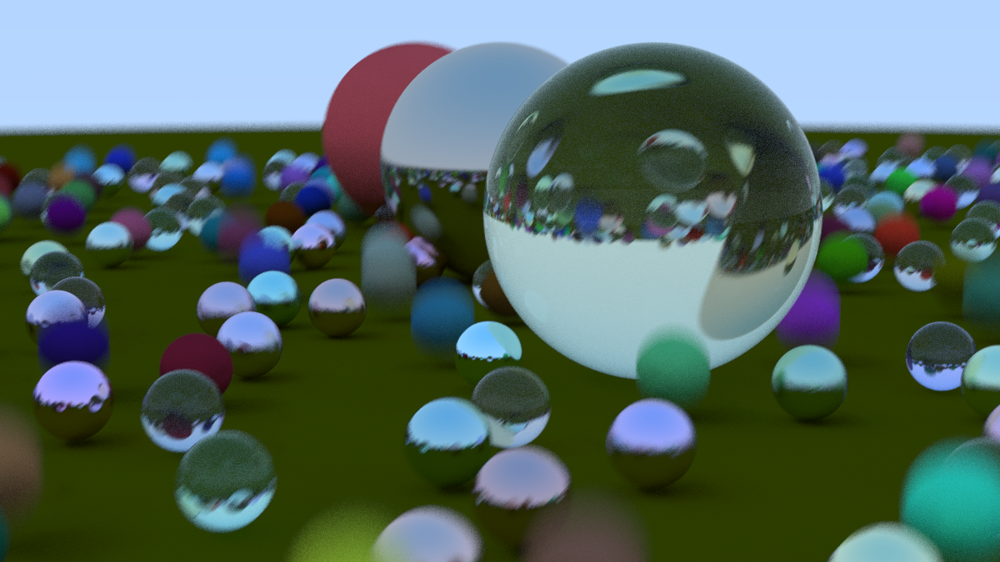

<h1 align="center">
     
    Software Raytracer
     
</h1>

<h2 align="center">
    Work in Progress raytracer built in C++.
</h2>

<h2>
    Summary
</h2>

This is a learning exercise and barebones approach to software raytracing that's built on spheres and casting rays from the camera to the objects in the scene until they hit a light source. This is the opposite approach as real life but it's faster this way because you only cast the rays from the camera instead of millions that come from the light source and miss the camera entirely. 

##

<h3>
    Features
</h3>

 - Depth of field
 - Materials:
    - Lambertian diffuse: takes in attenuation color and realistically diffuses light
    - Metal: takes in attenuation color and roughness and reflects light
    - Dielectric: takes in index of refraction and attenuation color and refracts light, also has total internal reflection
 - Anti-aliasing (samples each pixel multiple times)
 - Camera position movement
 - Ray bouncing

##

<h3>
    Current Render Status
</h3>

This will be updated as it progresses. Three materials currently exist: Lamberian diffuse, Dielectric, and Metal. These materials interact with the rays in different ways, allowing the raycasting to bounce around the scene and attenuate and scatter according to the material's properties. If the rays don't hit a material, they end up at the skybox and carry the color back to the camera.

##

    

##