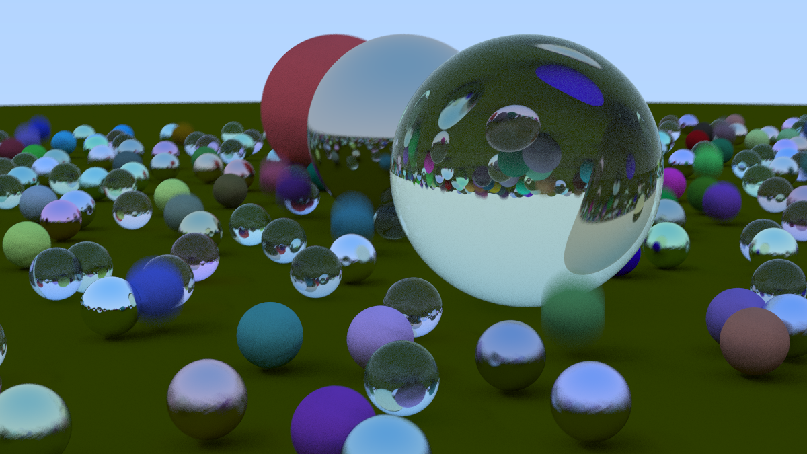

<h1 align="center">
     
    Software Raytracer
     
</h1>

<h2 align="center">
    Work in Progress raytracer built in C++.
</h2>

<h2>
    Summary
</h2>

This is a learning exercise and barebones approach to software raytracing that's built on spheres and casting rays from the camera to the objects in the scene until they hit a light source. This is the opposite approach as real life but it's faster this way because you only cast the rays from the camera instead of millions that come from the light source and miss the camera entirely. 

##

<h3>
    Current Render Status
</h3>

This will be updated as it progresses. Current shading is through surface normals, calculated through where the ray casts interact with the sphere.

    

##